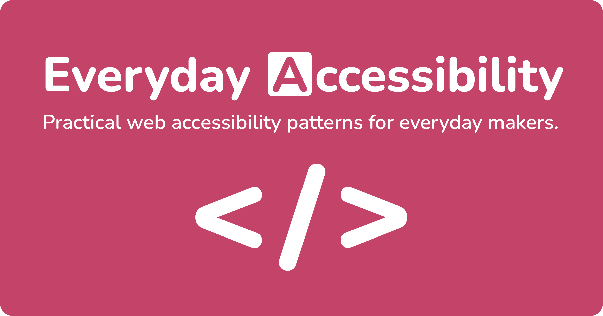

# Everyday A11y

**Everyday A11y** is a practical accessibility reference for frontend developers and designers. Existing resources tend to be dense, dated, or written for spec authors rather than developers. This one is not.

Not a WCAG checklist. Not a spec dump.
It is about building interfaces that work predictably with keyboards, screen readers, and real users. Every pattern includes working code examples.

🔗 **[estherh.dev/everyday-a11y](https://estherh.dev/everyday-a11y/)**

## 📖 Content

**Foundations** covers the fundamentals everything else builds on: semantic HTML, keyboard interaction, focus management, ARIA usage, visual hierarchy, colour and contrast, visually hidden content, focus appearance, motion, touch targets, and icon labeling. Includes an **ARIA Reference** subpage covering roles vs native HTML, states and properties, and common mistakes.

**Patterns** are organized by component type. Each pattern covers key requirements, dev notes, and a live interactive example.

| Pattern | Focus |
|---|---|
| Landmarks | Structure your page so assistive tech isn't guessing |
| Buttons & Links | Make actions act and links link |
| Navigation | Predictable paths beat clever layouts |
| Accordion | Progressive disclosure without progressive frustration |
| Tabs | Multiple panels, one logical focus order |
| Modal / Dialog | Manage focus like you mean it |
| Forms | Clear questions, clear errors, clear expectations |
| Live Region | Announce updates without stealing focus |
| Combobox | Filter long lists without leaving the input |
| Data Grid | Two-dimensional keyboard navigation for tabular data |
| Date Picker | Calendar navigation built on the grid pattern |
| Carousel | Rotating content that doesn't leave users behind |
| Image Gallery | A grid of images that opens each one in a focusable dialog |

**Check & Fix** covers tools and debugging workflows for when the problem is real but the cause is not obvious: finding missing labels, fixing incorrect ARIA, and diagnosing focus traps. Includes a curated tool list with [A11y Barker](https://github.com/estherj-hsu/a11y-barker), a Chrome DevTools extension built for this project.

## 🛠 Built With

- React + TypeScript
- Vite
- React Router
- SCSS
- Shiki (syntax highlighting)
- GitHub Pages

## 📜 License

MIT · Made with ❤️ by [Esther Hsu](https://estherh.dev/)
